# pg-optimization

Домашние задания практического курса по оптимизации и администрированию **PostgreSQL 18** (10 занятий; в репозитории — 9 готовых работ). Воспроизводимые эксперименты: тюнинг ОС и СУБД, пулинг соединений, файловые системы, бэкапы и репликация, мониторинг, WAL/checkpoint, автовакуум и проектирование схемы данных. Каждая работа оформлена единообразно — **стенд, методика, замеры, графики и выводы** со ссылками на исходные логи и конфиги.

Структура каждой работы: `hwNN/README.md` (отчёт) · `hwNN/images/` (графики) · `hwNN/logs/` (команды, сырые замеры, конфиги — для воспроизведения).

## Работы

| ДЗ | Тема | Стенд | Главный результат |
|---|---|---|---|
| [hw01](hw01/) | Первичная настройка ОС и PostgreSQL: бенчмарки и тюнинг | Raspberry Pi 4B | Отключение fsync: ×2.9 TPS на записи; тюнинг памяти: +17% на чтении |
| [hw02](hw02/) | Коннектинг: vanilla vs PgBouncer vs Odyssey vs HAProxy при 500+ коннектах | GCP e2-standard-4 | Пулер — не ускоритель: ваниль быстрее на быстрых запросах, но деградирует вдвое круче; оптимум пула ≈ 2×ядра |
| [hw03](hw03/) | ФС: секционирование по дням, секции на 3 дисках, COPY vs pgloader, ext4/xfs/btrfs | GCP + 3 диска | Pruning: ×49 по ключу, медленнее мимо ключа; COPY ×20 быстрее pgloader; разница ФС ≤15% |
| [hw04](hw04/) | Репликация: синхр./асинхр./каскад, 5 уровней синхронного коммита, hot_standby_feedback | GCP, 3 ВМ | Синхронность вдвое режет запись на `on`; каскад не грузит мастер; `2S_ALL` медленнее кворума |
| [hw05](hw05/) | Мониторинг: VictoriaMetrics + Grafana + postgres/node exporter + vmalert/Alertmanager | GCP, Docker | Стек собирается за минуты без суперюзера (`pg_monitor`); алерт на диск отработал; «нет алерта» ≠ «всё ок» |
| [hw06](hw06/) | Тюнинг WAL/checkpoint: производительность vs надёжность, восстановление, сжатие WAL | GCP e2-standard-4 | `synchronous_commit=off` +80% записи; редкий чекпойнт → дольше восстановление; сжатие WAL ×4.9 на заполненных страницах |
| [hw07](hw07/) | Тюнинг автовакуума на профиле update+delete: убираем пилу TPS | GCP e2-standard-4 | Дефолт = пила (CV 31%), отключение = деградация (CV 52%), частый автовакуум малыми порциями = ровно (CV 11%) и быстрее |
| [hw08](hw08/) | Схема данных: ускорение аналитики Chicago Taxi (10 ГБ) + 300 партиций | GCP e2-standard-4 | matview ×3800 быстрее; индексу нужен VACUUM ANALYZE; 300 партиций во все секции ×10 медленнее, JIT = 3038 функций |
| [hw09](hw09/) | Оптимизация запросов: отчёт по поездкам на 60 млн строк | GCP e2-standard-4 | Декартов взрыв → раздельные агрегаты (>180с→43с); индекс на FK (43→12с); преагрегат 0.18 мс |

## Ключевые находки

| | |
|---|---|
| [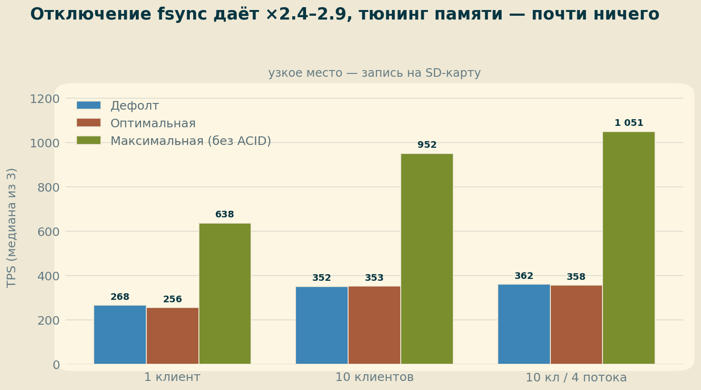](hw01/) |  |
| **hw01:** цена fsync на медленном носителе — трёхкратная разница TPS | **hw02:** каждый хоп и каждый лишний серверный коннект стоят TPS |
| [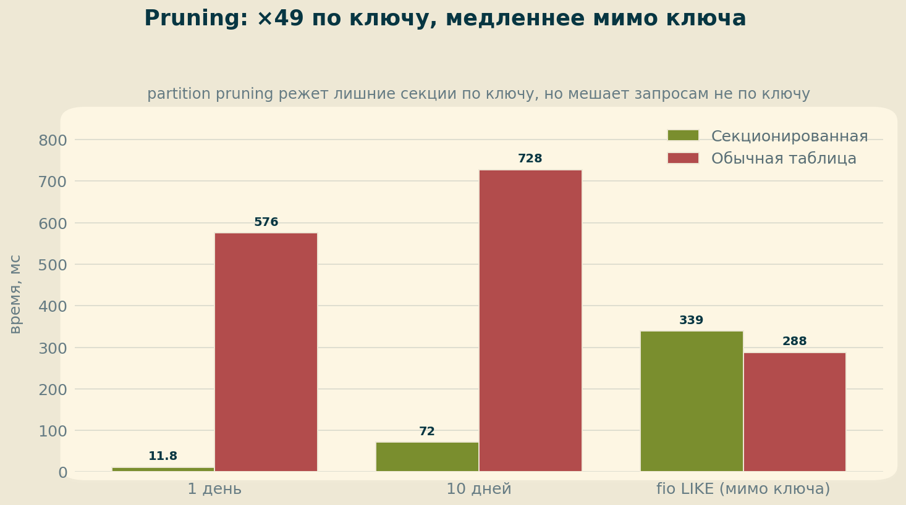](hw03/) | [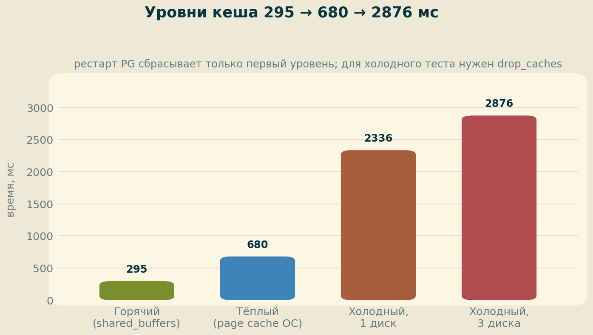](hw03/) |
| **hw03:** секционирование ускоряет только запросы по ключу | **hw03:** рестарт СУБД сбрасывает лишь первый из трёх уровней кеша |
| [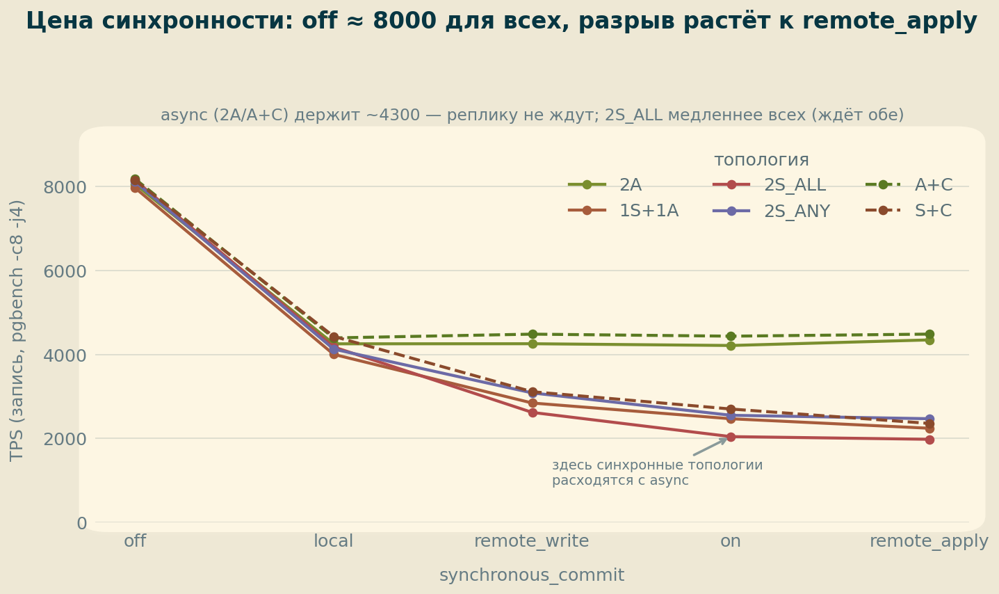](hw04/) | [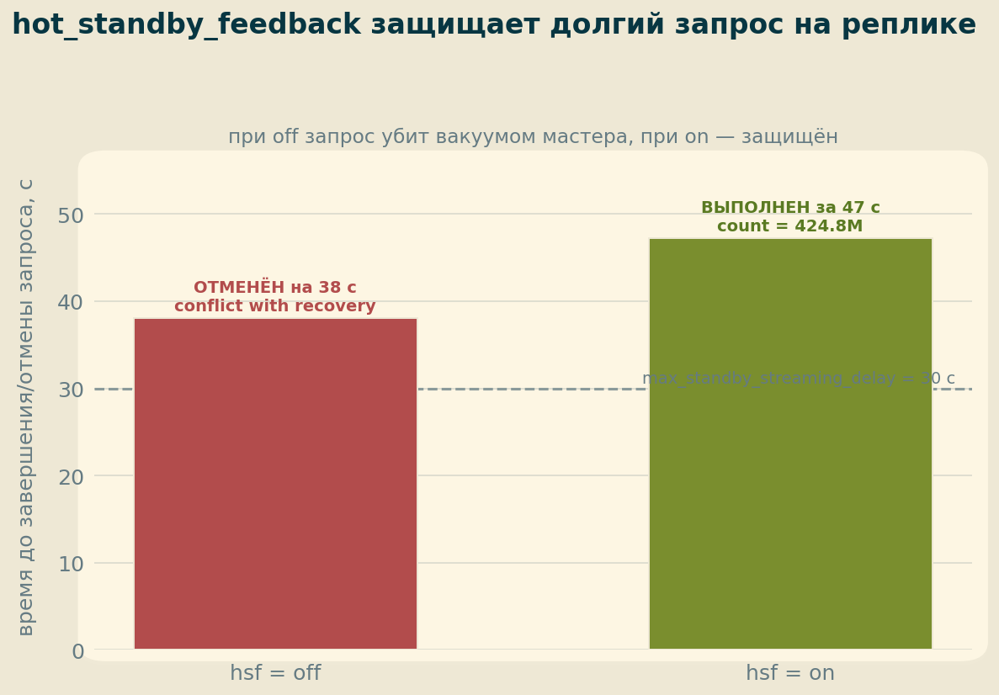](hw04/) |
| **hw04:** цена синхронности растёт `off→remote_apply`; ждать обе реплики дороже кворума | **hw04:** `hot_standby_feedback=on` спасает долгий запрос на реплике от вакуума мастера |
| [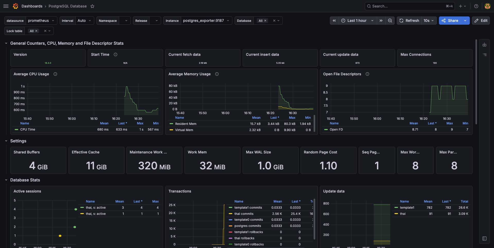](hw05/) | [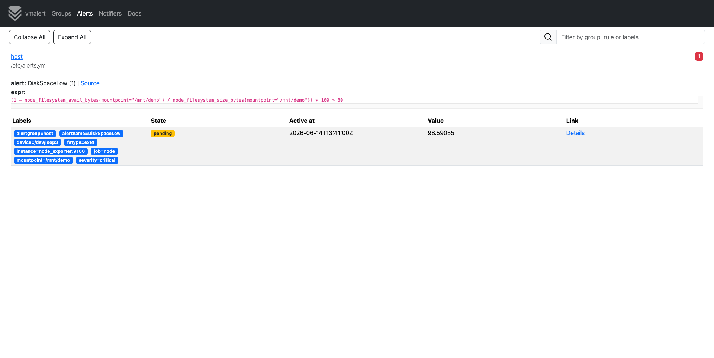](hw05/) |
| **hw05:** дашборд PostgreSQL под нагрузкой 25k TPS (VictoriaMetrics + Grafana) | **hw05:** алерт `DiskSpaceLow` сработал и доехал до Alertmanager |
| [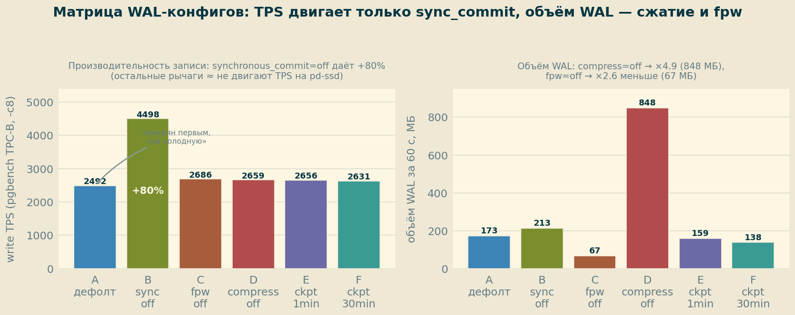](hw06/) | [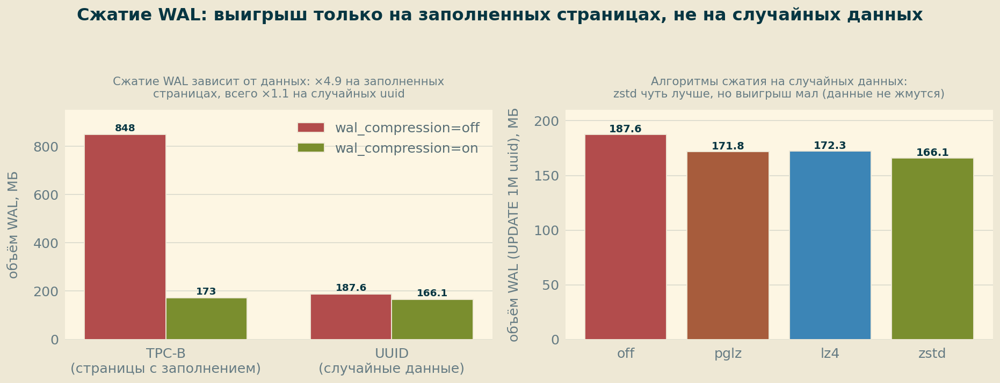](hw06/) |
| **hw06:** `synchronous_commit=off` +80% записи; `wal_compression` режет WAL ×4.9 | **hw06:** выгода сжатия WAL зависит от данных: ×4.9 на заполненных, ×1.1 на случайных |
| [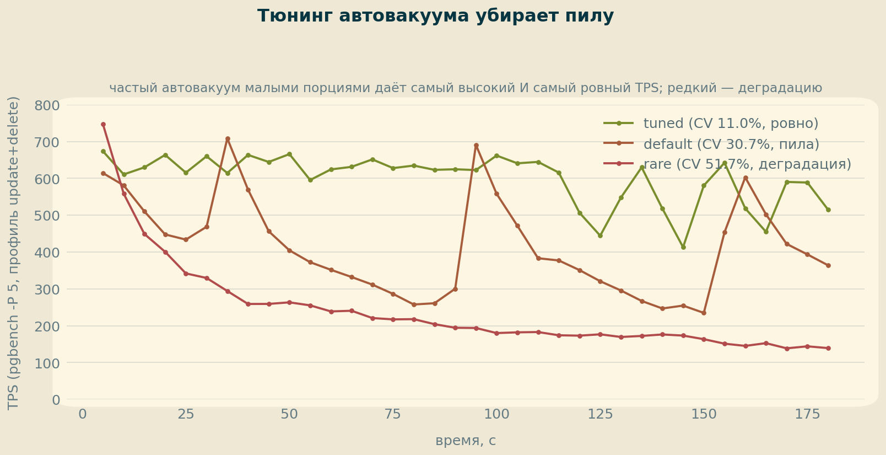](hw07/) | [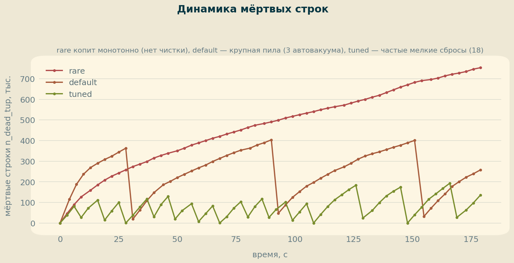](hw07/) |
| **hw07:** дефолтный автовакуум даёт пилу TPS; частый малыми порциями — ровную линию | **hw07:** `n_dead_tup` во времени: монотонный рост (rare) vs пила (default) vs коридор (tuned) |
| [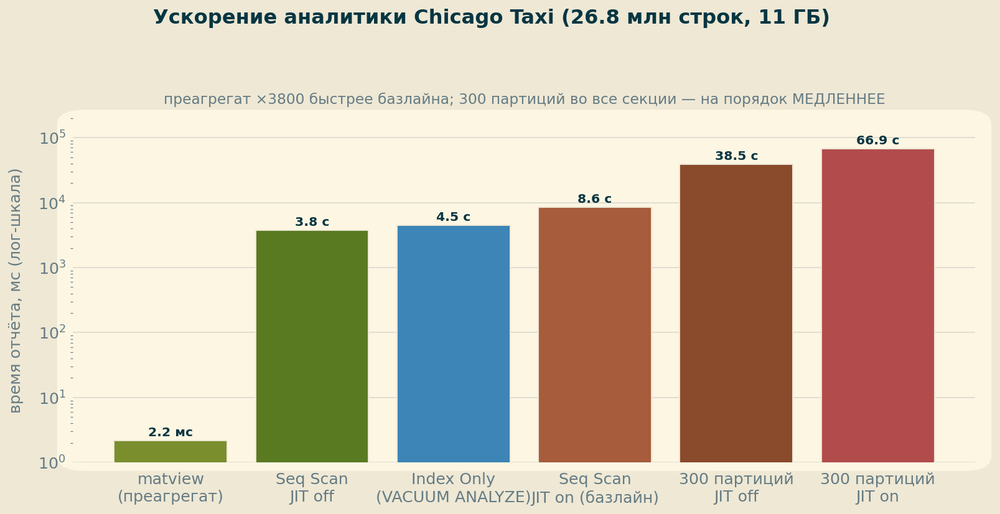](hw08/) | [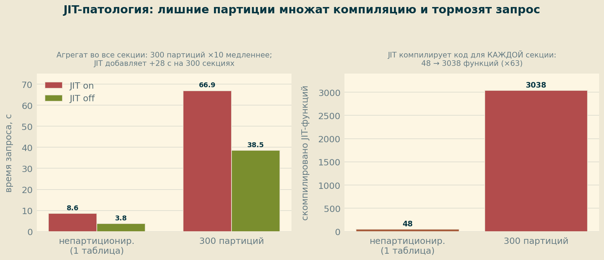](hw08/) |
| **hw08:** matview ×3800 быстрее; индексу нужен VACUUM ANALYZE; 300 партиций ×10 медленнее | **hw08:** JIT на 300 секциях = 3038 функций, +28 с (продолжение hw03) |
|  | |
| **hw09:** отчёт на 60 млн строк: декартов взрыв → раздельные агрегаты → индекс → преагрегат (>180с → 0.18мс) | |

## Стенды

- **Raspberry Pi 4B** (4×Cortex-A72, 8 ГБ, microSD) — узкое место IO: эффекты fsync, чекпоинтов и WAL видны невооружённым глазом (hw01).
- **GCP e2-standard-4** (4 vCPU, 16 ГБ, pd-ssd) — повторяет лекционный стенд курса; в разных топологиях:
  - одна ВМ — пулеры, файловые системы, WAL/checkpoint, автовакуум, схема данных (hw02, 03, 06, 07, 08);
  - **3 ВМ** — мастер + две реплики для физической/каскадной репликации и pg_rewind (hw04);
  - **+ Docker** — стек мониторинга в контейнерах (hw05);
  - **+ доп. диски** — секции на pd-ssd/pd-standard, сравнение ФС (hw03).

## Инструментарий

- **Нагрузка и бенчмарк:** [pgbench](https://www.postgresql.org/docs/current/pgbench.html)
- **Пулеры и баланс:** [PgBouncer](https://www.pgbouncer.org/) · [Odyssey](https://github.com/yandex/odyssey) · [HAProxy](https://www.haproxy.org/)
- **Мониторинг:** [VictoriaMetrics](https://victoriametrics.com/) · [Grafana](https://grafana.com/) · [postgres_exporter](https://github.com/prometheus-community/postgres_exporter) · node_exporter · vmalert + Alertmanager
- **Диагностика:** `pg_stat_statements` · `pg_buffercache` · `pageinspect` · `pg_waldump` · `pg_test_fsync` · `pg_stat_progress_*`
- **Репликация и восстановление:** `pg_basebackup` · `pg_rewind` · слоты репликации
- **Данные:** [«Тайские перевозки»](https://github.com/aeuge/postgres16book/tree/main/database) (~5 млн строк) · Chicago Taxi (~27 млн строк, 11 ГБ, через [gcsfuse](https://github.com/GoogleCloudPlatform/gcsfuse))
- **Инфраструктура:** GCP Compute Engine · Docker Compose · [pgconfigurator](https://pgconfigurator.cybertec.at/)

## Полезные материалы

- [PostgreSQL: Tuning Your Server](https://wiki.postgresql.org/wiki/Tuning_Your_PostgreSQL_Server) — стартовый чеклист от сообщества
- [Kernel Resources](https://www.postgresql.org/docs/current/kernel-resources.html) — overcommit, OOM, huge pages
- [Non-Durable Settings](https://www.postgresql.org/docs/current/non-durability.html) — официальный список «скорость в обмен на надёжность»
- [WAL Configuration](https://www.postgresql.org/docs/current/wal-configuration.html) — checkpoint, max_wal_size, full_page_writes
- [Routine Vacuuming](https://www.postgresql.org/docs/current/routine-vacuuming.html) — автовакуум и защита от XID wraparound
- [Цикл «Постгрес изнутри» Егора Рогова](https://habr.com/ru/companies/postgrespro/articles/) — буферный кеш, MVCC, индексы, блокировки
- [How to SCRAM with pgBouncer](https://www.crunchydata.com/blog/pgbouncer-scram-authentication-postgresql) — аутентификация через пулер
