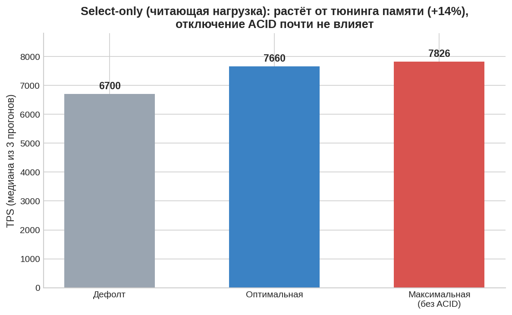
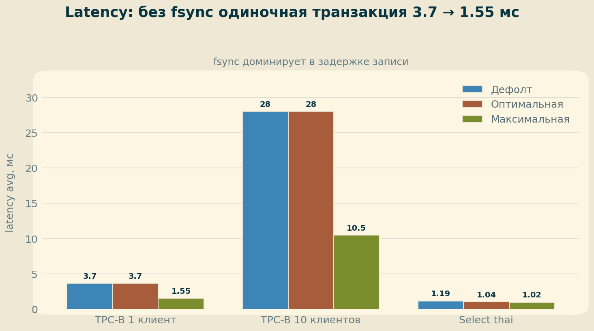
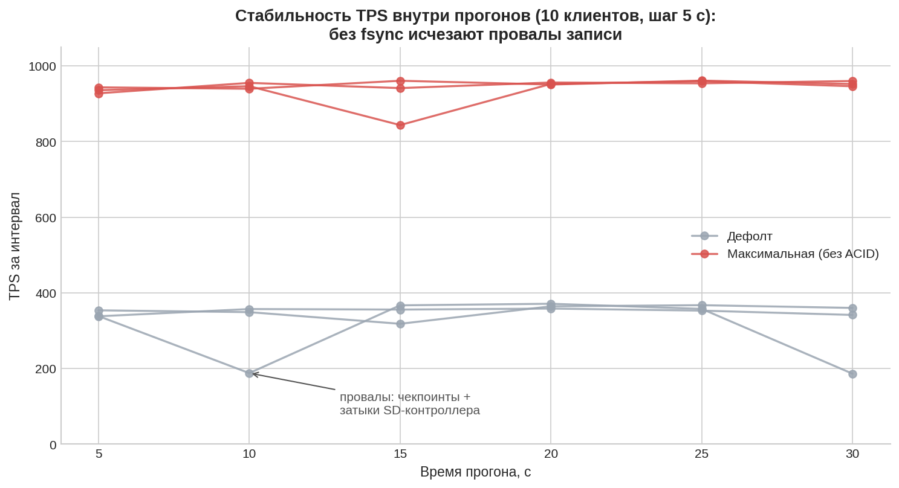

# ДЗ 1. Первичная настройка ОС и PostgreSQL

Развёртывание PostgreSQL 18 на Raspberry Pi 4B, бенчмаркинг и тюнинг в трёх конфигурациях: дефолтная → оптимальная → максимальная (без гарантий ACID).

## 1. Стенд

| Компонент | Значение |
|---|---|
| Железо | Raspberry Pi 4B, 4 ядра ARM Cortex-A72, 8 ГБ RAM |
| Хранилище | microSD 128 ГБ (`/dev/mmcblk0`) — **узкое место по записи** |
| ОС | Ubuntu 22.04.5 LTS (jammy), aarch64 |
| PostgreSQL | 18.4 из официальной репы PGDG |
| Swap | отсутствует (осознанно: подход «без swap» + экономия ресурса SD-карты) |

Установка:

```bash
sudo sh -c 'echo "deb http://apt.postgresql.org/pub/repos/apt $(lsb_release -cs)-pgdg main" > /etc/apt/sources.list.d/pgdg.list'
wget --quiet -O - https://www.postgresql.org/media/keys/ACCC4CF8.asc | sudo gpg --dearmor -o /etc/apt/trusted.gpg.d/pgdg.gpg
sudo apt update && sudo apt -y install postgresql-18
```

## 2. Методика

Два профиля нагрузки, каждый замер — 3 прогона по 30 сек, в таблицах медиана TPS:

1. **TPC-B (пишущий)** — штатный сценарий pgbench (UPDATE×3 + SELECT + INSERT на транзакцию): 1 клиент / 10 клиентов / 10 клиентов + 4 потока.
2. **Select-only (читающий)** — учебная БД «Тайские перевозки» (~6 млн строк, 600 МБ), случайные выборки по PK, 8 клиентов / 4 потока:

```sql
\set r random(1, 6000000)
SELECT id, fkRide, fio, contact, fkSeat FROM book.tickets WHERE id = :r;
```

```bash
pgbench -P 5 [-c 10] [-j 4] -T 30 postgres        # TPC-B
pgbench -n -c 8 -j 4 -T 30 -f ~/workload.sql thai # select-only
```

## 3. Конфигурации

### 3.1. Дефолтная

PostgreSQL 18 «из коробки»: shared_buffers = 128MB, random_page_cost = 4.0 и т.д.

### 3.2. Оптимальная (надёжность сохранена)

ОС:

```bash
echo never > /sys/kernel/mm/transparent_hugepage/enabled  # THP вредны для БД (паузы khugepaged)
sysctl -w vm.nr_hugepages=1072  # расчёт: postgres -C shared_memory_size_in_huge_pages
```

postgresql.conf:

```ini
shared_buffers = '2GB'              # 25% RAM
effective_cache_size = '5GB'        # подсказка планировщику: ~65% RAM
work_mem = '16MB'                   # с оглядкой на формулу RAM > SB + conn × work_mem
maintenance_work_mem = '256MB'
huge_pages = try                    # фактически on, проверено huge_pages_status
random_page_cost = 1.1              # флеш-память: случайное чтение ≈ последовательное
effective_io_concurrency = 2        # SD-карта не умеет параллельный IO (100+ — для NVMe)
checkpoint_timeout = '15min'
checkpoint_completion_target = 0.9  # размазываем запись чекпоинта
max_wal_size = '2GB'
min_wal_size = '512MB'
wal_buffers = '16MB'
wal_compression = on                # тратим CPU, экономим запись на медленную карту
shared_preload_libraries = 'pg_stat_statements'
track_io_timing = on
```

### 3.3. Максимальная (ACID отключён — только для теста!)

Поверх оптимальной, по официальному списку Non-Durable Settings:

```ini
synchronous_commit = off   # коммит не ждёт записи WAL (риск потери транзакций)
fsync = off                # вообще не ждём диск (риск КОРРУПЦИИ при сбое!)
full_page_writes = off     # без страховки от частичной записи страниц
checkpoint_timeout = '60min'
max_wal_size = '4GB'
autovacuum = off           # только на время бенчмарка
```

## 4. Результаты

Медианы TPS из 3 прогонов:

| Тест | Дефолт | Оптимальная | Максимальная | Эффект |
|---|---|---|---|---|
| TPC-B, 1 клиент | 268 | 256 | **638** | ×2.4 |
| TPC-B, 10 клиентов | 352 | 353 | **952** | ×2.7 |
| TPC-B, 10 клиентов, 4 потока | 362 | 358 | **1051** | ×2.9 |
| Select-only thai, 8 клиентов | 6700 | **7660** | 7826 | +14% |




Latency (avg, по характерным прогонам):

| Тест | Дефолт | Оптимальная | Максимальная |
|---|---|---|---|
| TPC-B, 1 клиент | 3.7 ms | 3.7 ms | **1.55 ms** |
| TPC-B, 10 клиентов | 28 ms | 28 ms | **10.5 ms** |
| Select-only thai | 1.19 ms | 1.04 ms | 1.02 ms |



Стабильность внутри прогонов (TPS по 5-секундным интервалам, 10 клиентов, все 3 прогона каждой конфигурации):



## 5. Выводы

1. **Узкое место определяет, какой тюнинг работает.** Пишущий TPC-B на дефолте и «оптимальной» конфигурации показывает одинаковые ~270/360 TPS: каждый коммит ждёт fsync на SD-карту, и настройки памяти на это не влияют. Читающий тест, наоборот, вырос на 14–17% именно от тюнинга памяти (shared_buffers 2GB + huge pages — вся БД в кеше).

2. **Цена fsync видна напрямую.** Отключение синхронной записи подняло пишущий тест в 2.4–2.9 раза, а latency одиночной транзакции упала с 3.7 до 1.55 мс — разница и есть стоимость ожидания записи WAL на SD-карту.

3. **Стабильность тоже выросла.** На дефолте отдельные прогоны проваливались до 87–180 TPS (чекпоинты + затыки SD-контроллера), stddev latency 19–34 мс. Без fsync stddev упал до ~5 мс — диск перестал быть точкой конкуренции (см. график стабильности выше).

4. **Цена «максимальной» конфигурации.** `synchronous_commit = off` — потеря последних транзакций при сбое (без коррупции), допустимо для некритичных данных. `fsync = off` — риск полного разрушения БД при отключении питания; на проде неприменимо. Реалистичный продакшн-компромисс — оптимальная конфигурация + `synchronous_commit = off` для некритичных сессий.

5. **Замечание по huge pages.** После старта PG: `HugePages_Total: 1072, Free: 1029, Rsvd: 1029` — страницы захвачены процессом и занимаются физически по мере прогрева кеша. Контроль: `show huge_pages_status;` → `on`.

## 6. Воспроизведение

```bash
# Учебная БД
wget https://storage.googleapis.com/thaibus/thai_small.tar.gz && tar -xf thai_small.tar.gz && psql < thai.sql
# Бенчмарки — раздел 2; конфигурации — раздел 3; рестарт:
pg_ctlcluster 18 main restart
```
