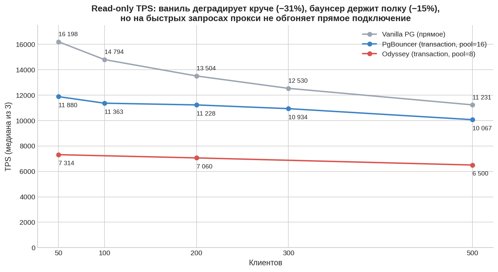
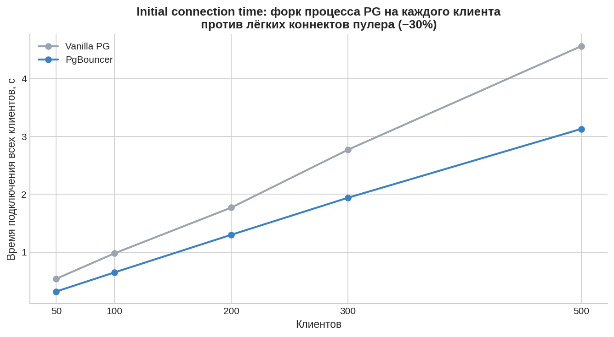
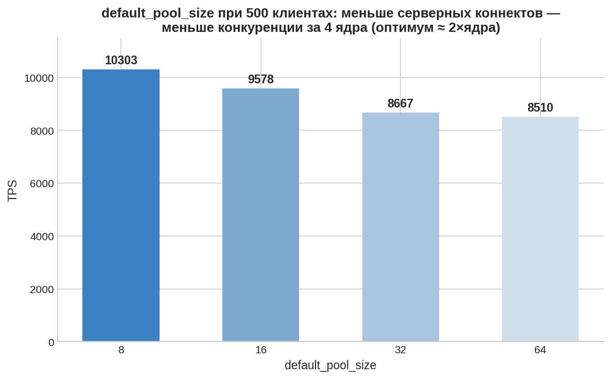
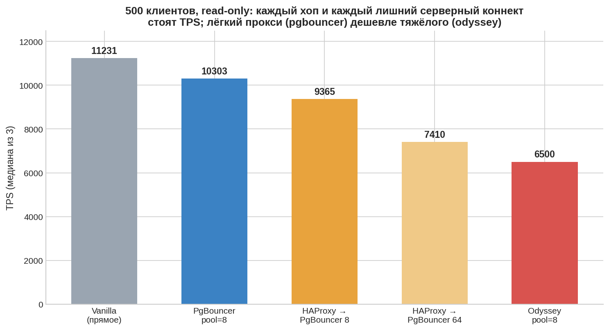

# ДЗ 2. Коннектинг: ванильный PostgreSQL vs пулеры при 500+ коннектах

Сравнение производительности при 500+ одновременных подключениях: прямое подключение к PostgreSQL 18, PgBouncer, Odyssey (*), HAProxy (**).

## 1. Стенд

| Компонент | Значение |
|---|---|
| ВМ | GCP e2-standard-4 (4 vCPU, 16 ГБ RAM), pd-ssd 100 ГБ, europe-west1-b |
| ОС | Ubuntu 24.04 LTS |
| PostgreSQL | 18.4 (PGDG), `max_connections = 600`, shared_buffers 4 ГБ, базовый тюнинг по курсу |
| PgBouncer | 1.21 (apt), `pool_mode = transaction`, auth scram-sha-256, userlist из pg_shadow |
| Odyssey | сборка из master (release), pool transaction, pool_size 8 |
| HAProxy | 2.8, mode tcp, цепочка → PgBouncer |
| БД / профиль | thai (~6 млн строк); read-only: случайный SELECT по PK (~0.5 мс/запрос) |

Методика: pgbench `-c {50,100,200,300,500} -j 4 -T 30`, по 3 прогона, в таблицах медианы. Все компоненты на одной ВМ (узкое место — CPU; зафиксировано в выводах).

## 2. Vanilla vs PgBouncer: лестница нагрузки

| Клиенты | Vanilla TPS | Bouncer TPS | Vanilla lat | Bouncer lat | Conn time V → B |
|---|---|---|---|---|---|
| 50 | 16 198 | 11 880 | 3.1 ms | 4.2 ms | 0.54 → 0.32 s |
| 100 | 14 794 | 11 363 | 6.8 ms | 8.8 ms | 0.98 → 0.65 s |
| 200 | 13 504 | 11 228 | 14.8 ms | 17.8 ms | 1.77 → 1.30 s |
| 300 | 12 530 | 10 934 | 23.9 ms | 27.4 ms | 2.77 → 1.94 s |
| 500 | 11 231 | 10 067 | 44.5 ms | 49.7 ms | 4.56 → 3.13 s |

Наблюдения:

- Ваниль деградирует с ростом клиентов: 50→500 = **−31% TPS**, latency ×14. 500 backend-процессов борются за 4 ядра; время подключения растёт линейно (~9 мс/клиент — цена fork).
- Баунсер деградирует вдвое медленнее (**−15%**), connection time на ~30% ниже, и он защищает от отказа за пределами `max_connections` (ваниль при 600+ клиентах отвечает `too many clients already`).
- Но на этом профиле (быстрые запросы 0.5 мс) баунсер **не обогнал ваниль ни в одной точке**: лишний хоп через прокси стоит дороже, чем выигрыш от меньшего числа backend'ов. Пулер — не ускоритель TPS, а средство управления коннектами.
- htop при 500 клиентах через баунсер: процесс pgbouncer 66–74% **одного** ядра (однопоточность — фактический потолок ~10–11k TPS), при этом PG-backend'ы загружены на 10–11% — база недогружена.

## 3. Подбор default_pool_size (500 клиентов)

| pool_size | TPS |
|---|---|
| **8** | **10 303** |
| 16 | 9 578 |
| 32 | 8 667 |
| 64 | 8 510 |

Оптимум ≈ 2×ядра: меньше серверных коннектов — меньше конкуренции за CPU. Механика пулера видна в `SHOW POOLS` во время прогона: **46 клиентов активны, 454 в очереди** на 16 серверных коннектов, maxwait 70 мс.

## 4. (*) Odyssey

Многопоточный пулер Яндекса (3 воркера, pool 8, transaction): 50 кл. — 7 314, 200 — 7 060, 500 — **6 500 TPS**. Хуже однопоточного баунсера на ~37%.

Проверка гипотез:

- Debug-сборка? Пересборка в release — без изменений (~6 500).
- Конкуренция потоков за ядра? `workers 1 / 2 / 3` → 6 459 / 6 523 / 6 500 — **TPS не зависит от числа воркеров**.

Вывод: узкое место — цена обработки каждого сообщения. PgBouncer почти не разбирает протокол («не нуждается в полных пакетах» — из его документации), Odyssey через kiwi полноценно парсит каждое сообщение и планирует корутины. На запросах 0.5 мс этот оверхед доминирует. Сильные стороны Odyssey (многоядерные хосты, TLS-терминация, тонкое управление пулами) на стенде 4 vCPU не задействованы — подтверждение тезиса курса «тестируйте на своём железе и профиле».

## 5. (**) HAProxy: цена лишнего хопа

Цепочка клиент → HAProxy → PgBouncer → PG при 500 клиентах:

| Путь | TPS | latency |
|---|---|---|
| Vanilla (прямое) | 11 231 | 44.5 ms |
| PgBouncer pool=8 | 10 303 | 48.5 ms |
| HAProxy → PgBouncer pool=8 | 9 365 | 53.4 ms |
| HAProxy → PgBouncer pool=64 | 7 410 | 67.6 ms |
| Odyssey pool=8 | 6 500 | 76.9 ms |

Лишний TCP-хоп HAProxy стоит ~9% TPS и +5 мс latency — плата за балансировку и failover, которые он даёт в кластере из нескольких нод. Случайный бонус: первая серия прогонов прошла при `pool_size = 64` за HAProxy (7 410 TPS) — независимое подтверждение вывода п.3 о вреде большого пула.

## 6. Выводы

1. На профиле быстрых read-only запросов **прямое подключение быстрее любого прокси** — пулер не ускоряет TPS, его ценность в другом: плоская деградация, дешёвые подключения, защита от исчерпания max_connections, PAUSE/RESUME при обслуживании.
2. **PgBouncer — потолок одного ядра** (~10–11k TPS на этом стенде), виден в htop невооружённым глазом. Лечится so_reuseport/каскадом — следующий эксперимент за рамками ДЗ.
3. **Размер пула — главный тюнинг пулера**: оптимум ≈ 2×ядра; ×8 от оптимума → −17% TPS.
4. **Лёгкий прокси дешевле умного**: pgbouncer (перекладывание байтов) > odyssey (полный парсинг протокола) на быстрых запросах; многопоточность не помогает, если узкое место не в пулере.
5. **Каждый хоп стоит ~9–13%** — архитектуру (LB → пулер → БД) выбираем за функции, а не за скорость.

## 7. Воспроизведение

Логи прогонов — в [logs/](logs/). Конфиги: pgbouncer.ini (transaction, pool 8, scram), odyssey.conf, haproxy listen-секция — в [configs/](configs/).
