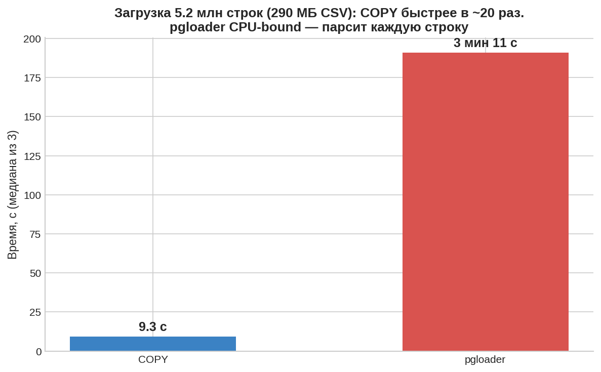
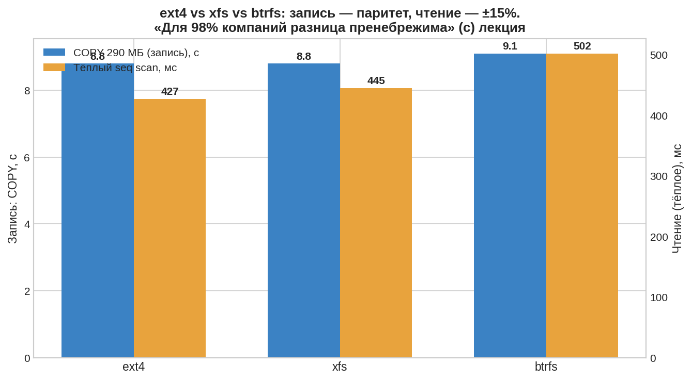

# ДЗ 3. Файловая система: секционирование, табличные пространства, COPY, сравнение ФС

Секционирование БД «Тайские перевозки» по дням, тесты partition pruning, разнесение секций по 3 дискам, COPY vs pgloader (*) и сравнение ext4/xfs/btrfs (**).

## 1. Стенд

| Компонент | Значение |
|---|---|
| ВМ | GCP e2-standard-4 (4 vCPU, 16 ГБ), europe-west1-b |
| Диск 1 (root) | pd-ssd 50 ГБ — pg_default |
| Диск 2 | pd-ssd 20 ГБ — tablespace ts_ssd |
| Диск 3 | pd-standard (HDD) 20 ГБ — tablespace ts_hdd |
| ОС / СУБД | Ubuntu 24.04 / PostgreSQL 18.4 (PGDG), shared_buffers 4 ГБ |
| БД | thai: book.tickets ~5.2 млн строк (572 МБ) |

## 2. Секционирование по дням

В `tickets` нет даты — она в `ride.startDate` (100 дней). Декларативное секционирование требует ключ в самой таблице, поэтому дата денормализована:

```sql
CREATE TABLE book.tickets_part (..., startDate date NOT NULL) PARTITION BY RANGE (startDate);
-- 100 дневных секций сгенерированы запросом + \gexec
-- данные перенесены INSERT ... SELECT с JOIN book.ride
CREATE INDEX ON book.tickets_part (startDate, id);
```

Итог: 100 секций по ~52 тыс. строк. Размер вырос 572 МБ → 1186 МБ (новая колонка ×5.2 млн + индекс).

## 3. Partition pruning: 1 / 10 / все секции

`EXPLAIN (ANALYZE, BUFFERS)`, сравнение с эквивалентными запросами к обычной таблице (через JOIN ride):

| Запрос | Секционированная | Обычная | Итог |
|---|---|---|---|
| 1 день | **11.8 мс** (1 секция, Index Only Scan, 202 буфера) | 576 мс (Seq Scan 59k буферов + Hash Join) | **×49** |
| 10 дней | **72 мс** (pruning: 10 из 100, Parallel Append) | 728 мс | **×10** |
| fio LIKE (ключа нет в WHERE) | 339 мс (jit off) / 636 мс (jit on) — 100 сканов | **288 мс** (1 скан) | ×1.2–2.2 медленнее |


Детали:

- **Цена планирования**: запрос «мимо ключа» — Planning 15.9 мс и 4777 буферов чтения каталога против 0.15 мс и 3 буферов у обычной таблицы (×100). На холодных кешах планирование доходило до **1.4 секунды**.
- **Секционирование × JIT — патология**: на 100-секционном плане JIT сгенерировал 908 функций, компиляция заняла 636 мс из 636 мс времени запроса. `SET jit = off` ускорил запрос вдвое (636 → 339 мс). При сотнях секций jit на таких запросах стоит отключать.
- Запрос по ключу выигрывает дополнительно за счёт денормализации (не нужен JOIN с ride) — отмечено как сопутствующий фактор.

## 4. Секции на 3 дисках и иерархия кешей

Секции и их индексы разнесены round-robin: pg_default (34) / ts_ssd (33) / ts_hdd (33) через генерацию `ALTER TABLE|INDEX ... SET TABLESPACE` + `\gexec`.

### Методическая находка №1: рестарт PG ≠ холодный тест

Первые «холодные» замеры после рестарта показали подозрительно быстрый I/O (~6 мкс/страница): **рестарт СУБД очищает shared_buffers, но не page cache ОС**. Честный холодный замер — `sync && echo 3 > /proc/sys/vm/drop_caches` при остановленном PG.

| Уровень кеша (скан всех секций, jit off) | Execution | I/O Timings |
|---|---|---|
| Горячий (shared_buffers) | ~295 мс | 0 |
| Тёплый (page cache ОС) | 651–710 мс | 370–517 мс |
| Холодный, 1 диск | 2 336 мс | 5 712 мс |
| Холодный, 3 диска | **2 876 мс (+23%)** | 7 413 мс |


### Разнесение по дискам: −23%, и вот почему

Посекционные I/O Timings холодного 3-дискового прогона двугорбые: секции на SSD — 35–80 мс, секции на HDD — 100–250 мс. **Parallel Append финиширует по самому медленному диску**: HDD-треть тянет вниз весь запрос, а выигрыша от параллельного IO нет — одиночный сетевой pd-ssd и так параллелит запросы внутри себя, плюс у 20-ГБ pd-standard крошечная квота IOPS (квоты GCP пропорциональны размеру).

Вывод: страйпинг секций по **разнородным** дискам — антипаттерн. Разнородные носители — для tiering'а (горячие секции на SSD, архив на HDD, где их и читают редко), а не для ускорения сканов.

## 5. (*) COPY vs pgloader

Загрузка 5 185 505 строк (290 МБ CSV), по 3 прогона с TRUNCATE:

| Метод | Время | Скорость |
|---|---|---|
| **COPY** | 8.7 / 9.1 / 10.1 с | ~32 МБ/с |
| pgloader 3.6.10 | 3:02 / 3:13 / 2:58 | ~1.6 МБ/с |



**×20 в пользу COPY.** Диагноз в `time`: у pgloader `user 3m34s > real 3m3s` — процесс CPU-bound, каждая строка проходит парсер и пайплайн трансформаций. pgloader выбирают за функциональность (миграции MySQL→PG, трансформации на лету, обработка ошибок), за скорость чистой загрузки — всегда COPY.

## 6. (**) ext4 vs xfs vs btrfs

На освобождённом pd-ssd диске последовательно: mkfs → tablespace → COPY ×2 (запись) → drop_caches → seq scan (чтение) ×2.

| ФС | COPY (запись) | Тёплый seq scan |
|---|---|---|
| ext4 | 8.4–9.2 с | 427 мс |
| xfs | 8.8–8.9 с | 445 мс |
| btrfs | 9.0–9.1 с | 502 мс |



### Методическая находка №2: «холодное чтение» после загрузки сравнивать нельзя

Холодные сканы показали 4.2 / 6.8 / 7.1 с, но в планах `dirtied=32711...58926`: первый scan после COPY не только читает — он **выставляет hint bits**, а при включённых по умолчанию (PG 18) checksums это ещё и полностраничные записи в WAL. Чтение заняло 15–25 мс (см. I/O Timings), остальное — запись. У ext4 «случайно» половину работы успел сделать автовакуум в паузе между командами. Лекарство из лекции — `COPY ... WITH FREEZE`: грузить сразу замороженные строки и не платить на первом чтении.

Вывод по ФС совпадает с лекционным: запись — паритет, чтение — ±15%, «для 98% компаний разница пренебрежима». Выбор ФС определяется операционкой (зрелость, инструменты, снапшоты), а не TPS.

## 7. Выводы

1. **Секционирование — не ускоритель, а инструмент управления данными.** Запрос по ключу — до ×49 быстрее (pruning + локальные индексы); запрос мимо ключа — медленнее обычной таблицы, плюс ×100 к стоимости планирования.
2. **JIT на множестве секций токсичен**: 908 скомпилированных функций = половина времени запроса. Мониторить блок JIT в EXPLAIN.
3. **Иерархию кешей надо понимать при бенчмарках**: shared_buffers → page cache ОС → диск это 295 мс → 680 мс → 2 876 мс на одном и том же запросе. Рестарт СУБД сбрасывает только первый уровень.
4. **Не смешивать диски разной скорости в одной раскладке** — Parallel Append ждёт медленнейшего. Разнородные носители — для hot/cold tiering.
5. **COPY — безальтернативен для bulk load** (×20 против pgloader); после загрузки помнить про hint bits / checksums (или COPY WITH FREEZE).
6. **Выбор ФС — операционное решение**, не перформансное.

## 8. Воспроизведение

DDL секционирования, перенос по tablespace (`\gexec`-генерация), методика drop_caches и конфиги — в тексте отчёта; полные планы EXPLAIN — в [logs/](logs/) (опционально).
