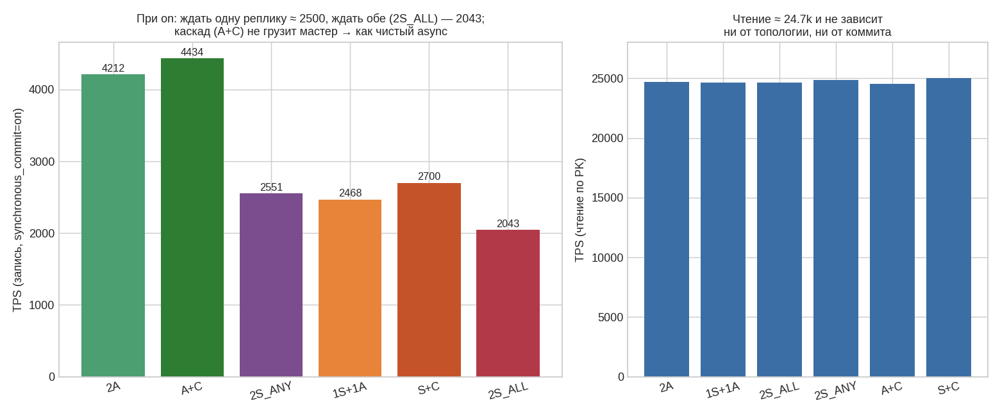
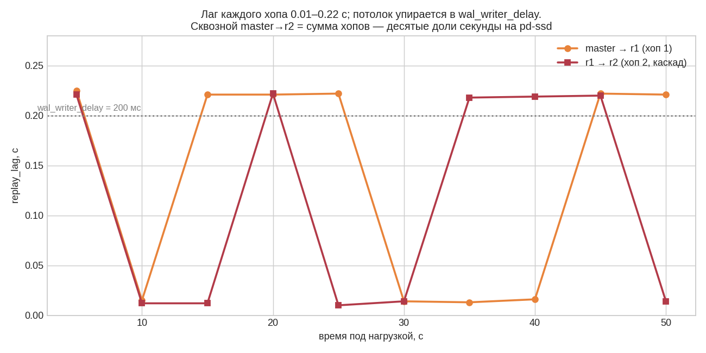

# ДЗ 4. Бэкапы и репликация: синхронная/асинхронная/каскадная, 5 уровней синхронного коммита

Развёрнута физическая репликация на трёх ВМ, протестированы два варианта из задания (синхронная + асинхронная; синхронная + асинхронная каскадная) плюс кворумные конфигурации `FIRST/ANY`. Замерена цена пяти уровней `synchronous_commit`, каскадный лаг и влияние `hot_standby_feedback`. Методика и матрица топологий — по разбору выпускника [pdpqbq/pg_opt/hw4-replication](https://github.com/pdpqbq/pg_opt/tree/main/hw4-replication).

## 1. Стенд

| Компонент | Значение |
|---|---|
| ВМ | 3 × GCP e2-standard-4 (4 vCPU, 16 ГБ), europe-west1-b, pd-ssd 50 ГБ |
| Узлы | `postgres4` (10.132.0.5) мастер · `postgres4r` (10.132.0.6) реплика 1 · `postgres4r2` (10.132.0.7) реплика 2 |
| ОС / СУБД | Ubuntu 24.04 / PostgreSQL 18.4 (PGDG), конфиг курса (shared_buffers 4 ГБ, `wal_writer_delay 200ms`, `max_slot_wal_keep_size 1000MB`) |
| БД | thai_medium: `book.tickets` = **53 997 475** строк |
| Нагрузка | pgbench `-c 8 -j 4 -T 30 -n`: запись — INSERT в `book.tickets`; чтение — SELECT по PK |

Имена реплик заданы через `cluster_name` (`postgres4r`/`postgres4r2`) — это `application_name`, на который ссылается `synchronous_standby_names`. Слоты репликации (`slot_r1`, `slot_r2`, `slot_cascade`) держат WAL до подтверждения реплики.

## 2. Топологии

| Код | Описание | `synchronous_standby_names` |
|---|---|---|
| **2A** | две асинхронные реплики | `''` |
| **1S+1A** | синхронная + асинхронная (**вариант 1 задания**) | `'postgres4r'` |
| **2S_ALL** | обе синхронные, ждём обе | `'FIRST 2 (postgres4r,postgres4r2)'` |
| **2S_ANY** | кворум, ждём любую одну | `'ANY 1 (postgres4r,postgres4r2)'` |
| **A+C** | асинхронная + каскадная с неё | `''` |
| **S+C** | синхронная + асинхронная каскадная (**вариант 2 задания**) | `'postgres4r'` |

В каскаде `postgres4r2` стримит не с мастера, а с `postgres4r`; мастер видит только `postgres4r`, а `postgres4r2` всегда асинхронна (каскадную реплику нельзя сделать синхронной мастеру).

## 3. Главный результат: цена синхронного коммита

Запись, TPS, по уровням `synchronous_commit`:

| commit | 2A | 1S+1A | 2S_ALL | 2S_ANY | A+C | S+C |
|---|---|---|---|---|---|---|
| off | 8053 | 7964 | 8145 | 8110 | 8177 | 8145 |
| local | 4252 | 4001 | 4177 | 4126 | 4393 | 4429 |
| remote_write | 4254 | 2843 | 2619 | 3083 | 4482 | 3112 |
| on | 4212 | 2468 | 2043 | 2551 | 4434 | 2700 |
| remote_apply | 4345 | 2242 | **1979** | 2469 | 4483 | 2357 |

Что видно:

- **`off` ≈ 8000 для всех топологий** — при `off` реплику вообще не ждут, fsync пропускается; это потолок записи, и он не зависит от того, сколько реплик подключено.
- **`off → local` — обвал вдвое** (8000 → ~4200): это цена локального fsync WAL на мастере, к репликации отношения не имеет.
- **`local` тоже одинаков у всех** (~4100–4400): без подтверждения реплики `synchronous_standby_names` не влияет.
- **Расхождение начинается на `remote_write/on/remote_apply`**, где мастер реально ждёт реплику. Async-топологии (2A, A+C) остаются плоскими ~4300 (`remote_*` без синхронного стендбая вырождаются в `local`), а синхронные монотонно проседают: ждать применения (`remote_apply`) дороже, чем приёма (`remote_write`).
- **`2S_ALL` — самая медленная** (`on` = 2043, `remote_apply` = 1979): ждёт обе реплики, то есть медленнейшую из двух. **`2S_ANY` (кворум 1 из 2)** и **`1S+1A`** быстрее — ждут одну.

## 4. Каскад не грузит мастер

`A+C ≈ 2A` и `S+C ≈ 1S+1A` на всех уровнях — наложение линий на графике не случайно:

Кормление второй реплики WAL'ом переносится с мастера на `postgres4r`, поэтому на TPS мастера вторая реплика в каскаде практически не влияет. Это и есть смысл каскадной репликации из лекции — снять сетевую/дисковую нагрузку отдачи WAL с primary. **Чтение ≈ 24.7k TPS и не зависит ни от топологии, ни от уровня коммита** — синхронность платится только на записи.

## 5. Каскадный лаг

Под нагрузкой (master async, `pgbench -T 60`), `replay_lag` из `pg_stat_replication` по каждому хопу:

Каждый хоп — 0.01–0.22 с, сквозной master→r2 = сумма, т.е. десятые доли секунды на pd-ssd. Характерный потолок ~0.22 с упирается в `wal_writer_delay=200ms` (фоновый сброс WAL в async-режиме), провалы до 0.012 с — когда коммит попал в немедленный flush.

**Методическая находка.** Первый замер делали через `now() - pg_last_xact_replay_timestamp()` — после конца нагрузки значение росло линейно (3.6 → 7.7 → 11.8 → …) на величину `sleep`. Это не backlog, а «время с последнего применённого коммита»: при простое растёт само по себе. Для лага под нагрузкой корректна именно `replay_lag` (при простое = NULL).

## 6. hot_standby_feedback: защита долгих запросов на реплике

Долгий аналитический запрос на реплике (near-cartesian join, ~40–70 с) при параллельном `UPDATE`+`VACUUM` на мастере:

| `hot_standby_feedback` | Результат |
|---|---|
| **off** (дефолт) | `ERROR: canceling statement due to conflict with recovery` через **38 с** (30 с `max_standby_streaming_delay` + приход конфликтного WAL). Вакуум мастера снёс версии строк, нужные снапшоту запроса. |
| **on** | запрос **выполнен за 47 с** (count 424.8M). Реплика сообщает мастеру свой `xmin`, `VACUUM` придерживает удаление. |

Компромисс: `hsf=on` спасает отчётные запросы на реплике ценой удержания «мусора» на мастере (риск раздувания) — отсюда три типовых профиля из конспекта (горячий резерв / OLTP-балансировка / реплика для отчётов) с разными `hot_standby_feedback` и `max_standby_streaming_delay`.

## 7. Грабли стенда (подтверждены на практике)

1. **`max_wal_senders` на реплике не может быть ниже мастерского.** После `pg_basebackup` реплика не стартовала: `FATAL: recovery aborted because of insufficient parameter settings: max_wal_senders = 0 is a lower setting than on the primary server, where its value was 4`. Поднять на реплике до старта.
2. **Кластер под systemd** — рестарт только `sudo systemctl restart postgresql@18-main`; `pg_ctlcluster 18 main restart` без `sudo` падает.
3. **`.pgpass` — в доме postgres** (`/var/lib/postgresql/.pgpass`, `chmod 0600`), а не в `/home/<user>`: `sudo su postgres` сохраняет `$HOME` вызывающего.
4. **`cluster_name` после каскадного basebackup** наследуется из `postgresql.auto.conf` источника (r1 → `postgres4r`) — переписать на `postgres4r2`.
5. **Каскадный basebackup со standby упирается в чекпойнт апстрима**: 5:47 при CPU 9% — почти всё ожидание; ручной `CHECKPOINT` на r1 разблокировал.
6. **Чекпойнт искажает короткие бенчмарки** (как в hw03): `checkpoint_completion_target=0.9 × 15 мин` растягивает запись грязных буферов, и первый «холодный» прогон 2A показал заниженные `off=3143/local=1805`. Лечение — `CHECKPOINT` перед каждым прогоном; после этого `off` встал на честные ~8000.

## 8. Выводы

1. **Синхронность платится только на записи и только на уровнях `remote_write/on/remote_apply`.** `off` и `local` от топологии не зависят. На `on` цена синхронной реплики — примерно вдвое (4200 → 2000–2700).
2. **Ждать обе реплики (`FIRST 2`) дороже, чем кворум (`ANY 1`) или одну.** Для надёжности без лишней цены — кворумный коммит.
3. **Каскад разгружает мастер**: вторая реплика, снимаемая с первой, не влияет на TPS primary (`A+C≈2A`, `S+C≈1S+1A`). Цена — лишний хоп лага (десятые доли секунды).
4. **Репликация на pd-ssd по сути реалтайм** (лаг < `wal_writer_delay`); чтение от синхронности не страдает.
5. **`hot_standby_feedback` — главный тумблер «реплика для отчётов»**: off убивает долгие запросы вакуумом мастера, on защищает их ценой возможного bloat.

## 9. Воспроизведение

Артефакты — в [logs/](logs/):

- [00_setup.sh](logs/00_setup.sh) — развёртывание мастера и реплик, каскад, все грабли с лечением
- [01_matrix_tps.csv](logs/01_matrix_tps.csv) — матрица 6 топологий × 5 уровней `synchronous_commit` (write + read)
- [02_replication_lag.txt](logs/02_replication_lag.txt) — `replay_lag` по хопам + разбор артефакта метрики лага
- [03_hot_standby_feedback.txt](logs/03_hot_standby_feedback.txt) — эксперимент с конфликтом recovery (off → отмена, on → успех)

Сценарий нагрузки (`workload2.sql` — INSERT, `workload.sql` — SELECT по PK) и скрипты-бенчи (`bench_phase1.sh`, `bench_phase2.sh` с `CHECKPOINT`-сбросом перед каждым прогоном) — в 00_setup.sh и тексте отчёта.

## 10. Задание со * (pg_rewind): failover и возврат бывшего мастера

Сценарий из [aeuge/pg_rewind](https://github.com/aeuge/pg_rewind), отыгранный вживую на стенде (PG 18): отказ мастера → промоут реплики → бывший мастер возвращается репликой через `pg_rewind` вместо полной перезаливки. Полный лог — [04_pg_rewind.txt](logs/04_pg_rewind.txt).

1. **Промоут** `postgres4r` в новый мастер (`SELECT pg_promote()`), новая линия времени (TL 2). Каскадная `postgres4r2` автоматически переехала следить за новым мастером.
2. **Расхождение**: на старом мастере `postgres4` (ещё TL 1) создана таблица `rewind_div` — данные, которых нет на новом мастере.
3. **pg_rewind**: после чистой остановки старого мастера утилита нашла точку расхождения `3/FEB4AEE0` и последний общий чекпойнт, и посчитала **635 МБ к переносу против 7.3 ГБ полной копии** — на порядок дешевле `pg_basebackup`. `-R` сразу прописал `standby.signal` + `primary_conninfo`.
4. **Итог**: `postgres4` поднялся репликой нового мастера, `rewind_div` отброшена (`relation does not exist`), на `postgres4r` в `pg_stat_replication` обе реплики `streaming`, свежие записи нового мастера доезжают по TL 2.

Грабли и выводы:

- **Нужны data checksums** (или `wal_log_hints`) на цели — в PG 18 checksums включены по умолчанию, проверено `show data_checksums` → `on`.
- **`host replication` в pg_hba — отдельная строка**: `host all` не покрывает псевдо-БД `replication`.
- **Унаследованный слот**: перемотанный узел ссылался на `primary_slot_name='slot_r1'` (слот жил на нём же для бывшей реплики), которого нет на новом мастере → `FATAL: replication slot "slot_r1" does not exist`. Лечение — провизионить слот на новом мастере (`pg_create_physical_replication_slot`).
- **`timeline_id` в `pg_control_checkpoint()` обновляется лениво** (на restartpoint) — факт следования за новой веткой подтверждается приходом данных и `received_tli` в `pg_stat_wal_receiver`, а не контрол-файлом сразу.
