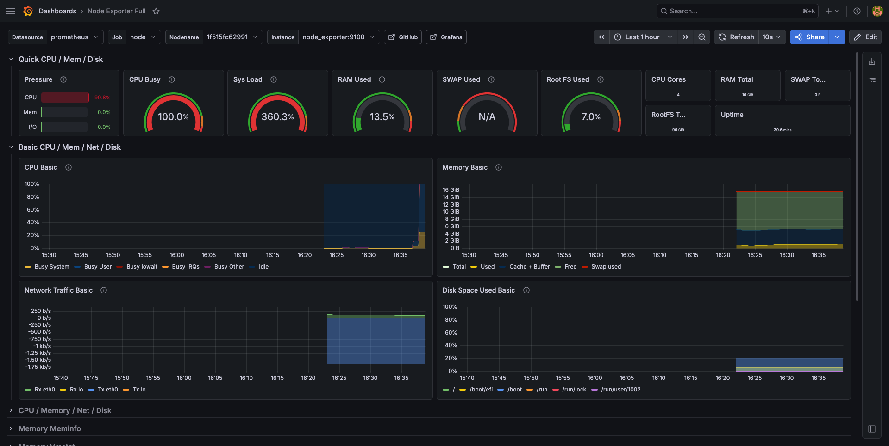
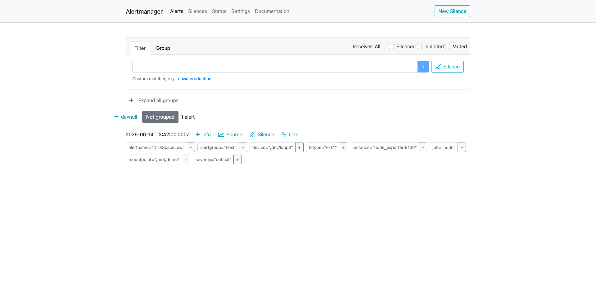

# ДЗ 5. Мониторинг PostgreSQL: VictoriaMetrics + Grafana + алертинг

Развёрнут стек мониторинга (VictoriaMetrics вместо Prometheus + postgres_exporter + node_exporter + Grafana + vmalert + Alertmanager), настроен мониторинг инстанса PostgreSQL, дана нагрузка pgbench и отработан алертинг на диск (тот самый «эффект Toyota» из лекции). Эталон выпускника — [pdpqbq/hw5-monitoring](https://github.com/pdpqbq/pg_opt/tree/main/hw5-monitoring) (на PPEM); здесь — независимый от PgPro open-source стек.

## 1. Стенд

| Компонент | Значение |
|---|---|
| ВМ | GCP e2-standard-4 (4 vCPU, 16 ГБ), europe-west1-b, pd-ssd 100 ГБ |
| ОС / СУБД | Ubuntu 24.04 / PostgreSQL 18.4 (PGDG), конфиг курса (shared_buffers 4 ГБ, `pg_stat_statements`, `track_io_timing`) |
| БД | thai_small: `book.tickets` = 5 185 505 строк |
| Стек мониторинга | Docker Compose: VictoriaMetrics, postgres_exporter, node_exporter, Grafana, vmalert, Alertmanager |
| Роль | `monitoring` с `pg_monitor` (доступ к `pg_stat_*` без суперюзера) |

```
node_exporter:9100  ─┐
postgres_exporter:9187─┤→ VictoriaMetrics :8428 ─→ Grafana :3000 (дашборды 1860, 9628)
                       └→ vmalert :8880 ──(alert)──→ Alertmanager :9093
```

postgres_exporter подключается к PG как `monitoring` через `host.docker.internal` (`extra_hosts: host-gateway`). VictoriaMetrics сам скрейпит таргеты (`-promscrape.config`) — отдельный Prometheus не нужен. UI открывались через SSH-туннель (`-L 3000 -L 8880 -L 9093`), порты наружу не публиковались.

## 2. Что мониторим

Проверено, что метрики текут (`pg_up=1`, оба таргета `up=1`):

- **PostgreSQL** (дашборд Grafana **9628**): активные сессии и их состояния, commit/rollback, TPS, hit ratio буферного кеша, размеры БД, блокировки. Источник — `postgres_exporter` поверх `pg_stat_database`, `pg_stat_activity`, `pg_stat_statements`.
- **ОС** (дашборд **1860** Node Exporter Full): CPU, RAM, дисковый I/O, сеть, использование ФС.




## 3. Нагрузка

Профиль чтения по PK (из скрипта занятия), `pgbench -c 20 -j 4 -T 180`:

| Метрика | Значение |
|---|---|
| TPS | **25 151** |
| Латентность (avg) | 0.795 мс |
| Транзакций | 4 526 397 |
| Ошибок | 0 |

На дашбордах во время прогона видно скачок активных сессий (~20), рост TPS/commit и CPU; чтение по индексу почти не грузит диск (данные прогреты в shared_buffers).

## 4. Алертинг (ключевой пункт)

Правила vmalert (`alerts.yml`): `DiskSpaceLow` (>80% на ФС), `MemoryHigh` (>85%), `TooManyConnections` (>150). Маршрутизация в Alertmanager.

**Демонстрация disk-алерта** — отдельная loop-ФС 2 ГБ, заполнена до 99%:

```bash
sudo fallocate -l 2G /demo.img && sudo mkfs.ext4 -F /demo.img
sudo mount -o loop /demo.img /mnt/demo
sudo fallocate -l 1800M /mnt/demo/fill     # df: 1.8G/2.0G = 99%
```

Жизненный цикл алерта виден по таймстампам: vmalert вычислил expr (`value = 98.59 > 80`) и перевёл правило в **pending** (ждёт `for: 30s`), затем — в **firing** и отправил в Alertmanager (13:41 → 13:42).




**Грабли:** `node_exporter` стартовал до `mount`, и новый loop-моунт не сразу попал в его mount-namespace — метрики по `/mnt/demo` не появлялись, алерт молчал. Лечение — `docker compose restart node_exporter` (перечитывает моунты хоста при старте). После этого `node_filesystem_avail_bytes{mountpoint="/mnt/demo"}` появился, expr вернул ~99 > 80, алерт зажёгся.

## 5. Выводы

1. **Связка VictoriaMetrics + postgres_exporter/node_exporter + Grafana собирается за минуты** и без суперюзера в PG (хватает роли `pg_monitor`). VM — drop-in замена Prometheus (тот же PromQL и экспортёры), память экономнее.
2. **Алертинг — не «график», а отдельный контур**: vmalert вычисляет правила и шлёт в Alertmanager. Без него «диск кончился ночью» = остановка СУБД (кейс Toyota из лекции).
3. **Метрика появляется в системе мониторинга только если экспортёр её видит**: динамически примонтированная ФС потребовала рестарта node_exporter — наглядный урок, что «нет алерта» ≠ «всё хорошо», надо проверять, что метрика вообще собирается.
4. **Prometheus/VM «всё лгут» между точками** (lookback до 5 мин, step ≥ scrape-интервала) — к графикам относиться критически, для точности на больших окнах брать оконные функции (см. конспект).
5. **Что мониторить** (из лекции): запросы и блокировки, ресурсы (CPU/RAM/диск/сеть/WAL/temp), буферный кеш, транзакции (idle in transaction!), репликация, чекпойнты/автовакуум, возраст таблиц (wraparound). Алертинг настраивать в т.ч. по прогнозу.

## 6. Воспроизведение

Артефакты — в [logs/](logs/):

- [00_setup_and_checks.sh](logs/00_setup_and_checks.sh) — полный сценарий: ВМ, PG, роль, стек, проверки метрик, нагрузка, триггер алерта, грабли
- [docker-compose.yml](logs/docker-compose.yml) — стек из 6 сервисов
- [scrape.yml](logs/scrape.yml) — таргеты VictoriaMetrics
- [alerts.yml](logs/alerts.yml) — правила vmalert (диск/память/соединения)
- [alertmanager.yml](logs/alertmanager.yml) — минимальная маршрутизация

Профилирование (`auto_explain`, `pgBadger`) и instant-инструменты (`pgcenter`, `pg_top`) разобраны в [конспекте занятия 5](../../конспекты/05-мониторинг.md).
