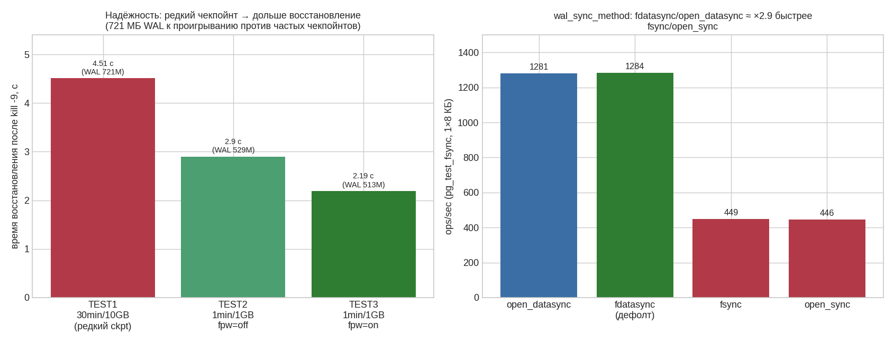

# ДЗ 6. Тюнинг checkpoint и WAL: производительность vs надёжность

Исследование, как параметры WAL и checkpoint влияют на пропускную способность записи, объём журнала и время восстановления после сбоя — то есть на компромисс «производительность ↔ надёжность». Эталон выпускника — [pdpqbq/hw6-checkpoint-wal](https://github.com/pdpqbq/pg_opt/tree/main/hw6-checkpoint-wal); здесь его методика (wal_level × объём WAL, восстановление, pg_test_fsync, сжатие) расширена матрицей TPS по 6 конфигурациям.

## 1. Стенд

| Компонент | Значение |
|---|---|
| ВМ | GCP e2-standard-4 (4 vCPU, 16 ГБ), europe-west1-b, pd-ssd 50 ГБ |
| ОС / СУБД | Ubuntu 24.04 / PostgreSQL 18.4 (PGDG), конфиг курса (shared_buffers 4 ГБ) |
| Данные | thai_small (`book.tickets` 5 185 505) для чтения; `t(u uuid)` и pgbench `-i -s 50` (TPC-B) для записи |
| Замеры | TPS — pgbench; объём WAL — `pg_wal_lsn_diff` / `pg_stat_statements.wal_bytes` / `pg_waldump -z`; восстановление — `redo done ... elapsed` из лога |

## 2. Влияние wal_level на объём WAL

Одинаковый набор операций (INSERT 1M + UPDATE 1M + DDL), три независимых метода замера:

| wal_level | pg_wal_lsn_diff | pg_stat_statements | pg_waldump |
|---|---|---|---|
| minimal | 224 723 200 | 215 059 287 | 215 064 310 |
| replica | 224 737 720 | 215 057 257 | 215 078 658 |
| logical | 224 734 088 | 215 067 402 | 215 074 731 |

**При тяжёлом DML `wal_level` почти не влияет** на объём WAL (≈215 МБ, разброс <0.01%): объём определяется самими данными (INSERT/UPDATE), а надбавка уровня сидит в DDL-части и на этом фоне незаметна. Три метода замера сходятся — методика надёжна.

## 3. Производительность: матрица 6 конфигураций

pgbench TPC-B (запись, `-c8 -j4 -T60`) + SELECT по PK (чтение, `-T30`), `CHECKPOINT` перед каждым прогоном:

| Конфиг | Что меняли | write TPS | read TPS | WAL за 60 c, МБ |
|---|---|---|---|---|
| A | дефолт курса | 2492* | 25693 | 173 |
| **B** | `synchronous_commit=off` | **4498** | 26245 | 213 |
| C | `full_page_writes=off` | 2686 | 26171 | **67** |
| D | `wal_compression=off` | 2659 | 26124 | **848** |
| E | частый чекпойнт (1min/256MB) | 2656 | 26564 | 159 |
| F | редкий чекпойнт (30min/10GB) | 2631 | 26487 | 138 |

- **`synchronous_commit=off` — главный рычаг скорости записи: +80% TPS** (2492→4498). Цена — долговечность: при сбое теряются последние транзакции (до `3×wal_writer_delay`). Это и есть суть «производительность vs надёжность».
- **`full_page_writes=off` урезает WAL в ×2.6** (173→67 МБ): полностраничные образы (FPI) после чекпойнта доминируют в объёме журнала. TPS почти не растёт — диск не был узким местом.
- **`wal_compression=off` раздувает WAL в ×4.9** (173→848 МБ) при том же TPS: сжатие FPI на pd-ssd почти бесплатно по CPU и сильно экономит журнал.
- **Частота чекпойнта (E/F) на TPS не влияет** (~2630–2660) — её цена в надёжности (раздел 4).
- *Конфиг A замерян первым, «на холодную» (2492); тёплый уровень `synchronous_commit=on` — это согласованный кластер C/D/E/F ≈ 2630–2690.
- Чтение ≈ 26k TPS во всех конфигурациях — от WAL/checkpoint не зависит.

## 4. Надёжность: время восстановления после kill -9

Нагрузка 180 с → `pkill -9 postgres` → старт → время проигрывания WAL из лога:

| Тест | checkpoint | FPW | WAL в pg_wal | Восстановление |
|---|---|---|---|---|
| TEST1 | 30min / 10GB (редкий) | on | 721 МБ | **4.51 с** |
| TEST2 | 1min / 1GB (частый) | off | 529 МБ | 2.90 с |
| TEST3 | 1min / 1GB (частый) | on | 513 МБ | **2.19 с** |

**Редкий чекпойнт → дольше восстановление**: за 180 с без чекпойнта накопилось 721 МБ WAL, которые надо проиграть (4.51 с); при чекпойнте раз в минуту проигрывается только последняя минута (~2–3 с). На быстром pd-ssd разрыв скромный (у выпускника на 7 ГБ WAL восстановление доходило до 49 с), но направление однозначно: **конфиг с высоким TPS (редкий чекпойнт, раздел 3 F) расплачивается временем восстановления**. `full_page_writes` на время восстановления заметно не влияет — он про объём WAL и защиту от torn page, а не про логику REDO.

## 5. wal_sync_method (pg_test_fsync)

`fdatasync` (дефолт Linux) и `open_datasync` дают ~1280 ops/sec — в **×2.9 быстрее** `fsync`/`open_sync` (~447). Подтверждает рекомендацию оставлять `fdatasync`; по надёжности методы равны (кроме `fsync_writethrough`).

## 6. Сжатие WAL зависит от сжимаемости данных

UPDATE всей таблицы = полностраничные образы в WAL (их и жмёт компрессия):

| Данные | off | сжато | эффект |
|---|---|---|---|
| TPC-B (страницы с заполнением) | 848 МБ | 173 МБ (pglz) | **×4.9** |
| UUID (случайные данные) | 187.6 МБ | 166.1 МБ (zstd) | ×1.1 |

Алгоритмы на случайных uuid: off 187.6 / pglz 171.8 / lz4 172.3 / **zstd 166.1** МБ. Случайные данные несжимаемы — выигрыш всего ~11%; страницы с повторяющимся заполнением жмутся в разы. **Вывод: выгода `wal_compression` сильно зависит от данных** — на «реальных» страницах с заполнением огромная, на энтропийных (uuid, зашифрованное, сжатое) почти нулевая.

## 7. Выводы

1. **`synchronous_commit` — главный тумблер «скорость ↔ долговечность»**: off даёт +80% записи ценой потери последних транзакций при сбое.
2. **Чекпойнт — компромисс «производительность ↔ время восстановления»**: реже → больше WAL и дольше recovery, но на TPS почти не влияет; чаще → быстрое восстановление ценой роста I/O и (при FPW) объёма WAL.
3. **FPI доминируют в объёме WAL**: `full_page_writes=off` режет журнал ×2.6 (но снимает защиту от torn page — отключать только при надёжном хранилище).
4. **`wal_compression` почти бесплатно по CPU на pd-ssd**, экономия объёма зависит от данных (×4.9 на заполненных страницах, ×1.1 на случайных).
5. **`wal_level` на объём WAL при DML влияет пренебрежимо** — разница только в DDL.
6. **`fdatasync` — оптимальный `wal_sync_method`** на этом железе.

«Серебряной пули нет»: WAL + shared_buffers + checkpoint — это выбор двух свойств из трёх (скорость / надёжность / объём).

## 8. Воспроизведение

Артефакты — в [logs/](logs/):

- [00_setup_and_method.sh](logs/00_setup_and_method.sh) — стенд и методика всех четырёх шагов
- [01_results.txt](logs/01_results.txt) — сырые результаты (wal_level, матрица, восстановление, fsync, сжатие)
- [bench6.sh](logs/bench6.sh) — матрица 6 конфигураций (ALTER SYSTEM + reload)
- [recovery_all.sh](logs/recovery_all.sh) — тест восстановления после kill -9
