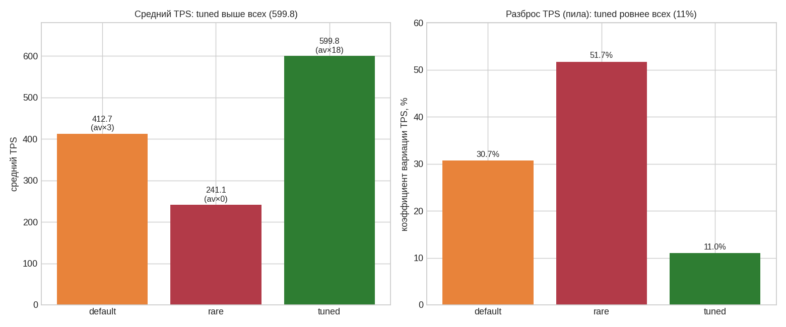

# ДЗ 7. Тюнинг автовакуума: убираем пилу TPS на профиле update+delete

Бенчмарк автовакуума при дефолтных настройках и подбор параметров для равномерной нагрузки на профиле UPDATE+DELETE. Эталон выпускника — [pdpqbq/hw7-opt-vacuum](https://github.com/pdpqbq/pg_opt/tree/main/hw7-opt-vacuum) (методика DELETE+INSERT, наблюдение пилы, пер-табличный тюнинг); здесь добавлены UPDATE, метрики `n_dead_tup` во времени и коэффициент вариации TPS как численная мера «пилы».

## 1. Стенд и профиль

| Компонент | Значение |
|---|---|
| ВМ | GCP e2-standard-4 (4 vCPU, 16 ГБ), europe-west1-b, pd-ssd 50 ГБ |
| ОС / СУБД | Ubuntu 24.04 / PostgreSQL 18.4 (PGDG), конфиг курса (shared_buffers 4 ГБ) |
| Таблица | `t (id serial PK, u uuid)`, старт 200 000 строк |
| Нагрузка | `pgbench -c4 -j4 -T180 -P5`: UPDATE 51 строк + DELETE 50 + INSERT 50 за транзакцию |

Метрики: ряд TPS из `pgbench -P 5`, `n_dead_tup`/размер из `pg_stat_user_tables` (семплинг каждые 3 с), `autovacuum_count`. «Пилу» меряем **коэффициентом вариации TPS** (stddev/mean).

## 2. Три режима автовакуума

| Режим | Настройка | autovacuum | mean TPS | CV TPS |
|---|---|---|---|---|
| **default** | дефолт (`scale_factor=0.2`, `naptime=1min`) | 3× | 412.7 | 30.7% |
| **rare** | пороги задраны (почти не запускается) | 0× | 241.1 | 51.7% |
| **tuned** | `scale_factor=0.01`, `threshold=100`, `naptime=10s`, `max_workers=4`, `cost_limit=2000` | 18× | **599.8** | **11.0%** |

- **default — пила**: автовакуум ждёт, пока намусорит ~20% таблицы (~400k мёртвых строк), затем разом чистит. На графике TPS видны провалы (накопление мусора замедляет запросы) и резкие всплески (после чистки). CV 30.7%.
- **rare — деградация**: автовакуум не запускается, мёртвые строки копятся монотонно (до 753k), мусорные страницы забивают кеш — TPS сползает с 746 до 139, CV 51.7%, средний вдвое ниже default.
- **tuned — ровно и быстро**: частый автовакуум малыми порциями держит мусор низким; TPS **и самый высокий (599.8), и самый ровный (CV 11.0%)**. Пила исчезла.

Динамика `n_dead_tup` объясняет TPS: rare — монотонный рост (нет чистки); default — крупная пила 0→400k→сброс (3 раза); tuned — частые мелкие сбросы в узком коридоре (18 автовакуумов).

## 3. Почему «чаще и меньше» побеждает

Цель ДЗ — **равномерная нагрузка** — достигается не замедлением/отключением автовакуума, а наоборот: заставить его работать чаще и меньшими порциями. Низкие `scale_factor`/`threshold` запускают чистку при небольшом числе мёртвых строк, `naptime=10s` сокращает паузы, больший `cost_limit` даёт вакууму отрабатывать быстрее. Мусор не копится до больших пачек → нет резких провалов TPS. Бонусом растёт и средний TPS: «лёгкая» таблица эффективнее лежит в кеше и быстрее сканируется.

Пер-табличный тюнинг (`ALTER TABLE t SET (autovacuum_*)`) — правильный способ обслуживать «горячую» таблицу, не трогая весь кластер.

## 4. Важная оговорка про метрику размера

Профиль оказался **не count-stable**: под конкуренцией 4 клиентов `DELETE … ORDER BY id LIMIT 50` удаляет меньше 50 строк (клиенты конкурируют за одни и те же младшие `id`), а `INSERT` всегда добавляет 50 — таблица **растёт по числу строк** (в режиме tuned при 599 TPS дошла до ~7.3 млн живых строк). Поэтому абсолютный размер файла после прогона фиксированной длительности **не является чистой метрикой блоата**: он определяется суммарным числом транзакций (а tuned их сделал в 2.5× больше) и тем, что обычный `VACUUM` переиспользует место, но **не ужимает файл** (это делает только `VACUUM FULL`/`pg_repack`). Поэтому в выводах опираемся на стабильность TPS (CV) и динамику `n_dead_tup`, а не на размер файла.

## 5. Выводы

1. **Дефолтный автовакуум на интенсивном update+delete даёт пилу** (CV 30.7%): крупные пачки чистки = периодические провалы TPS.
2. **Отключать/замедлять автовакуум — худшее решение**: блоат, забитый кеш, монотонная деградация (CV 51.7%, TPS вдвое ниже).
3. **Решение — частый автовакуум малыми порциями** (низкие пороги пер-таблично + `naptime` ниже + `cost_limit` выше): TPS становится и выше, и ровнее (CV 11.0%).
4. **`n_dead_tup` во времени — лучшая диагностика**: монотонный рост = автовакуум не справляется/выключен; крупная пила = пороги велики; узкий коридор = настроено хорошо.
5. **Для оценки блоата нужна аккуратная метрика** (dead ratio / `pgstattuple`), а не размер файла под нагрузкой с непостоянным числом строк.

## 6. Воспроизведение

Артефакты — в [logs/](logs/):

- [00_setup_and_method.sh](logs/00_setup_and_method.sh) — стенд, профиль, три режима, оговорка про метрику
- [vac_run.sh](logs/vac_run.sh) — прогон одного режима (сброс + семплер + pgbench -P5)
- [01_results.txt](logs/01_results.txt) — сводка (autovacuum_count, TPS mean/stddev/CV, динамика n_dead_tup)
