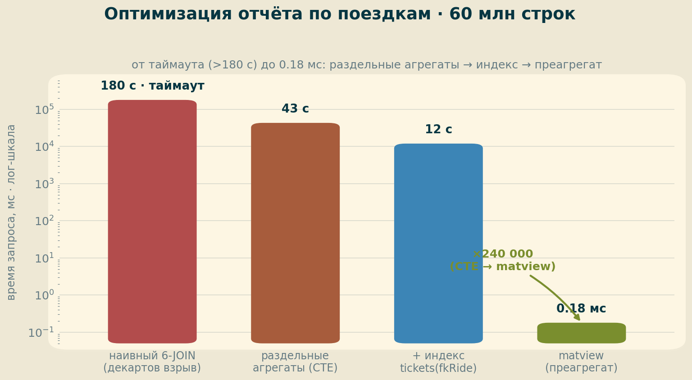

# ДЗ 9. Оптимизация запросов: отчёт по поездкам на 60 млн строк

Задача из лекции: составить отчёт «список поездок — город отправления и прибытия, всего мест в автобусе, сколько занято, сколько заработали на рейсе» и **добиться максимальной производительности** на БД в 60 млн строк.

## 1. Стенд и данные

| Компонент | Значение |
|---|---|
| ВМ | GCP e2-standard-4 (4 vCPU, 16 ГБ), europe-west1-b, pd-ssd 100 ГБ |
| ОС / СУБД | Ubuntu 24.04 / PostgreSQL 18.4 (PGDG), конфиг курса (shared_buffers 4 ГБ, parallel 4) |
| Данные | thai_medium + догенерация → `book.tickets` = **60 000 000** строк (валидные `fkRide` 1..1.5M, `fkSeat` 1..200) |

Схема `book` (Тайские перевозки). Важная деталь: **цена — в `book.schedule.price`**, не в `seatcategory` (там только `category`). Поэтому заработок на рейсе = `order_place × schedule.price`; город от/до — два JOIN к `busstation` через `busroute.fkbusstationfrom/to`.

## 2. Лестница оптимизации

| Вариант | Время | Что сделали |
|---|---|---|
| Наивный 6-JOIN | **> 180 с** (таймаут) | `tickets × seat` + два `count()` → декартов взрыв |
| Раздельные агрегаты (2 CTE) | **43.3 с** | развели агрегаты — нет взрыва |
| + индекс `tickets(fkRide)` | **12.0 с** | Index Only Scan вместо чтения 15-ГБ heap |
| jit = off | 12.0 с | JIT здесь не узкое место |
| **matview-преагрегат** | **0.18 мс** | потолок для повторяемого отчёта |

### Наивный вариант — декартов взрыв

Соединить `tickets` (60 млн) и `seat` в одном запросе и посчитать `count(t.id)` и `count(st.id)` — классическая ошибка: для каждого рейса получается произведение «билеты × места». `EXPLAIN` показал Merge Join на **2.4 млрд** промежуточных строк, GroupAggregate по 73.5М групп, оценочная стоимость **113.9 млн**. `EXPLAIN ANALYZE` не уложился в `statement_timeout = 180 с`.

### Раздельные агрегаты — главный рычаг

`order_place` (билеты по рейсам) и `all_place` (места по автобусам) считаются **независимыми** агрегатами в CTE, потом джойнятся по ключам. Декартова произведения нет → **43.3 с**. Но узкое место осталось: `HashAggregate` по `tickets` делает **Seq Scan по всему 15-ГБ heap** (1.97М страниц), да ещё в каждом из 3 параллельных воркеров.

### Индекс на FK — Index Only Scan

`CREATE INDEX idx_tickets_fkride ON book.tickets(fkRide)` (37.7 с на построение): агрегат `count(*) GROUP BY fkRide` переходит на **Parallel Index Only Scan** (`Heap Fetches: 0`) — читается узкий индекс вместо широкого heap. **43.3 → 12.0 с**.

### JIT здесь ни при чём

`SET jit = off` дал **те же 12.0 с**. В отличие от hw08 (где JIT на seq-scan-агрегате крал секунды), здесь узкое место — **объём данных агрегации** (60 млн записей всё равно надо прочитать), а не компиляция выражений.

### Преагрегат — потолок

Отчёт повторяемый → выносим его в materialized view (build 10 с) + индекс по `depart_date`. Отчёт превращается в `Index Scan` по готовым данным — **0.18 мс**. Это **×240 000** к варианту с CTE и **×66 000** к варианту с индексом. Цена — пересчёт matview (`REFRESH [CONCURRENTLY]`, занятие 10).

## 3. Выводы

1. **Не считать несколько `count()` в одном джойне разных таблиц** — это декартово произведение. Разделять на независимые агрегаты (CTE/подзапросы) — самый крупный выигрыш (>180 с → 43 с).
2. **Индекс на FK включает Index Only Scan** и убирает чтение широкого heap при агрегации (43 → 12 с). Обязателен `VACUUM ANALYZE` для visibility map (heap fetches 0).
3. **JIT — не универсальный ускоритель**: помогает CPU-bound выражениям, но не там, где узкое место — объём I/O агрегации. Проверять `jit on/off` замером.
4. **Для повторяемого отчёта потолок — преагрегат (matview)**: 0.18 мс против секунд. Платим разовым пересчётом.
5. Тип данных, `volatile/immutable`, `IN/=/EXISTS`, `search_path` (см. конспект) — на этом запросе вторичны; решает архитектура агрегации + индекс.

## 4. Воспроизведение

Артефакты — в [logs/](logs/):

- [00_setup_and_results.txt](logs/00_setup_and_results.txt) — стенд, схема (где цена), лестница замеров, выводы
- [queries.sql](logs/queries.sql) — наивный / оптимизированный / преагрегат + индексы
