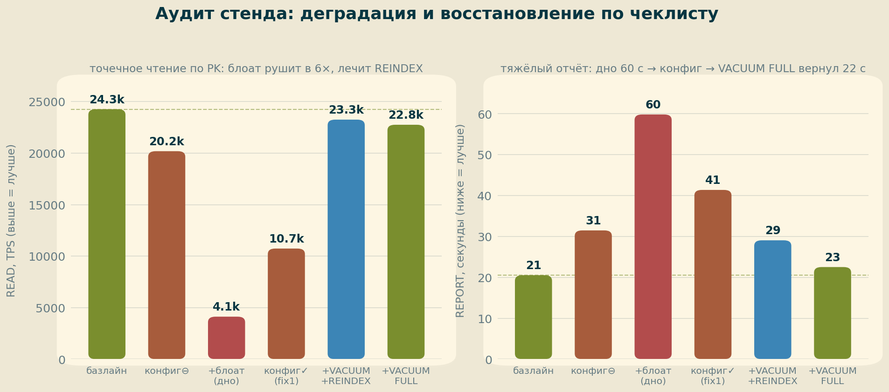
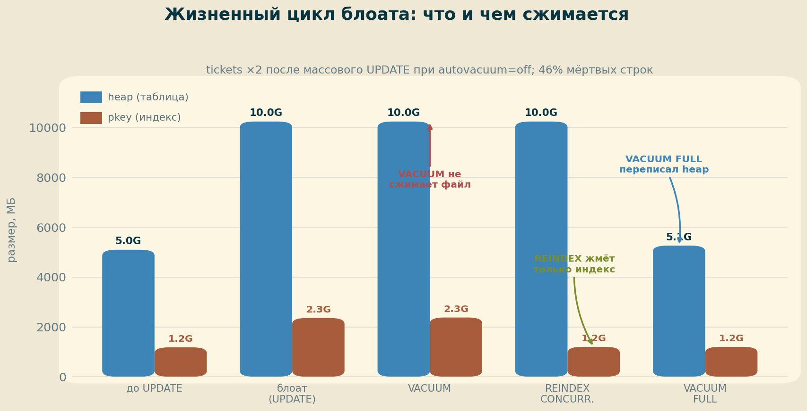
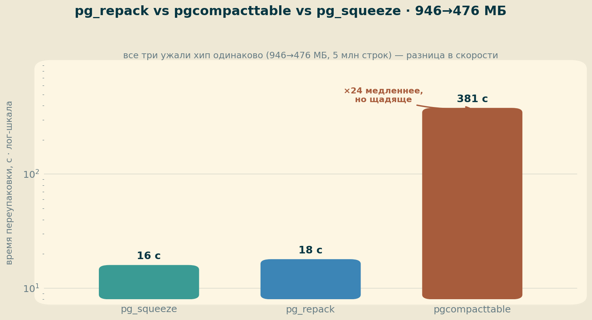
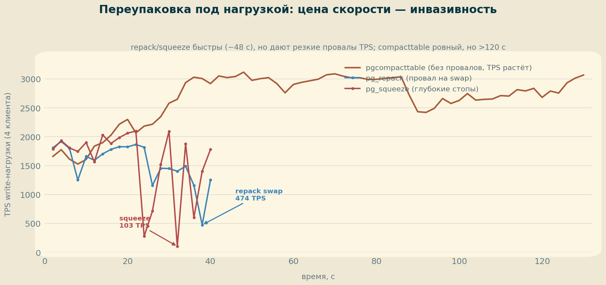

# ДЗ 10. Обслуживание СУБД: стенд с проблемами, аудит и переупаковка

Финальная работа курса. Строим стенд с заведомо неоптимальными настройками и раздутыми таблицами, проходим по сводному чеклисту обслуживания, **измеряя эффект каждого исправления бенчмарком**, и сравниваем три утилиты онлайн-переупаковки — `pg_repack`, `pgcompacttable`, `pg_squeeze` — по скорости, ресурсам и инвазивности под нагрузкой.

## 1. Стенд

| Компонент | Значение |
|---|---|
| Железо | GCP e2-standard-4 (4 vCPU, 16 ГБ RAM) |
| Хранилище | pd-ssd 50 ГБ |
| ОС | Ubuntu 24.04 LTS |
| PostgreSQL | 18.4 (PGDG) |
| БД | `thai` (thai_medium): `book.tickets` ≈ 54 млн строк, 6 ГБ |
| Утилиты | pg_repack 1.5.3 · pg_squeeze 1.9 · pgcompacttable (dataegret) |

## 2. Методика

Главный принцип занятия — **сначала инструмент замера, потом тюнинг**: иначе вместо цифр получаем «вроде стало быстрее». Три профиля нагрузки через `pgbench` (медиана 3 прогонов по 30 с, 10 клиентов / 4 потока):

- **READ** — точечная выборка по PK (`SELECT … WHERE id = :r`);
- **WRITE** — `INSERT` с автокоммитом;
- **REPORT** — тяжёлый отчёт по поездкам с раздельными агрегатами (наследие hw09), время одного прогона.

Сценарий: эталонный конфиг → **базлайн** → порча настроек → порча схемы/блоат (**дно**) → аудит по чеклисту с замером дельты на каждом шаге → возврат к базлайну. Все конфиги и сырые прогоны — в [`logs/`](logs/).

## 3. Аудит: деградация и восстановление

Портили стенд в два захода и так же лечили, изолируя вклад каждой группы проблем.

**Настройки** (`vm.swappiness=100`, THP `always`, `random_page_cost=10`, `max_wal_size=32MB`, весь параллелизм `=1`, `log_statement=all`, `autovacuum=off`). **Схема/данные**: внешний ключ переведён на `text` (`tickets.fkride`, `ride.id`), затем массовый `UPDATE` всех 54 млн строк при выключенном автовакууме раздул таблицу и индекс вдвое.

| Состояние | READ TPS | REPORT, с | WRITE TPS |
|---|---|---|---|
| Базлайн (эталон) | **24 267** | **20.5** | 5 637 |
| Конфиг испорчен | 20 191 | 31.5 | 5 419 |
| + блоат (**дно**) | **4 125** | **59.8** | 5 181 |
| Конфиг возвращён (fix1) | 10 738 | 41.4 | 5 425 |
| + VACUUM + REINDEX (fix2) | 23 255 | 29.1 | — |
| + VACUUM FULL (**финал**) | 22 757 | 22.5 | 5 599 |



Что показывает картина:

- **READ** определяется блоатом индекса — провал в **6 раз** (24k→4k), и возвращает его именно `REINDEX CONCURRENTLY` (ещё до сжатия хипа). Дополнительно `log_statement=all` бьёт по READ (просадка первого прогона на испорченном конфиге).
- **REPORT** страдает и от конфига (`random_page_cost=10` гонит seq scan, параллелизм=1 убивает параллельную агрегацию → +50 %), и от блоата (скан 10 ГБ). Полностью лечится только после `VACUUM FULL` (файл 10→5 ГБ).
- **WRITE** почти не реагирует на все порчи (5.2–5.6k): крошечный WAL и тотальное логирование на одиночных вставках сказываются слабо — в отличие от bulk-нагрузки.

## 4. Жизненный цикл блоата

`tickets` после массового `UPDATE` при `autovacuum=off`: **46 % мёртвых строк**, free 0.5 % (расти некуда), индекс — фрагментация листьев 50 %.



Три разных инструмента — три разных эффекта:

- **`VACUUM`** убирает мёртвые строки в FSM (dead 46 %→0, free→49 %), но **файл на диске не уменьшает** — 10 ГБ как были.
- **`REINDEX CONCURRENTLY`** перестраивает **только индекс** (2.36 ГБ→1.2 ГБ, плотность 90 %, фрагментация 0) — без долгой блокировки.
- **`VACUUM FULL`** переписывает **heap** (10→5.3 ГБ), но берёт `ACCESS EXCLUSIVE` — на хайлоаде неприменим. Отсюда и потребность в онлайн-утилитах ниже.

## 5. ★ Сравнение утилит переупаковки

Полигон — три одинаковые таблицы по 5 млн строк, раздутые вдвое (946 МБ heap, 46 % мёртвых).



| Утилита | Время | Heap после | Ресурсы | TOAST | Особенности |
|---|---|---|---|---|---|
| **pg_squeeze** | **16 с** | 476 МБ | внутри БД | да | bgworker, нужен `wal_level=logical` |
| **pg_repack** | **18 с** | 476 МБ | RSS 7.8 МБ | да | внешний бинарник, superuser + PK/UNIQUE |
| **pgcompacttable** | **381 с** | 476 МБ | RSS 23 МБ, CPU 2 % | нет | дробит на мелкие пакеты |

Все три ужали хип **одинаково** (946→476 МБ) — разница в скорости: `pg_squeeze` ≈ `pg_repack`, а `pgcompacttable` в ~24 раза медленнее (намеренно).

## 6. ★★ Под нагрузкой

Те же утилиты на раздутых таблицах под фоновым `pgbench` (write-нагрузка по PK той же таблицы).



- **pg_repack** — короткий, но **резкий провал до 474 TPS** в момент финального `ACCESS EXCLUSIVE` swap (latency stddev до 43 мс), иначе ~1800 TPS.
- **pg_squeeze** — **глубокие краткие стопы** на финализации (до **103 TPS**, −95 %, latency 40 мс): логическое декодирование + захват в конце.
- **pgcompacttable** — **ни одного провала**; TPS даже растёт (1660→3000+) по мере усыхания таблицы. Нулевая инвазивность ценой долгой работы (>120 с, не завершился на срезе).

Ни одна утилита не дала отказов транзакций (`0 failed`).

## 7. Выводы

1. **Без бенчмарка тюнинг — это гадание.** Один и тот же стенд: READ определяется блоатом индекса (−6×), REPORT — и конфигом, и блоатом хипа, WRITE — почти ничем из проверенного. Цифры сразу показывают, что лечить первым.
2. **Самые дорогие настройки** в нашем наборе — `random_page_cost=10` и убитый параллелизм (REPORT +50 %) плюс `log_statement=all` (бьёт по высокочастотному READ). Крошечный `max_wal_size=32MB` дал разброс REPORT (чекпойнт-штормы), но на лёгком OLTP-WRITE почти не виден.
3. **VACUUM ≠ сжатие файла.** Мёртвые строки возвращаются в FSM, но место ОС не отдаётся. Индекс сжимает `REINDEX CONCURRENTLY`, heap — `VACUUM FULL` или онлайн-утилиты.
4. **Выбор утилиты — компромисс скорость/инвазивность.** Есть окно обслуживания → `pg_repack`/`pg_squeeze` (16–18 с, но резкие провалы под нагрузкой). Нужно «вживую» без просадок → `pgcompacttable` (ровно, но долго и не трогает TOAST). `pg_squeeze` дополнительно требует `wal_level=logical` и умеет авто-перестроение по порогу.

## 8. Воспроизведение

```bash
# 1. эталонный конфиг + профили нагрузки (logs/00_setup.txt) → базлайн
# 2. порча: настройки (BAD overrides) + текстовый FK + массовый UPDATE при autovacuum=off
# 3. аудит по чеклисту (конспект §11): диагностика → фикс → замер дельты
# 4. блоат: VACUUM → REINDEX CONCURRENTLY → VACUUM FULL (logs/02_bloat.txt)
# 5. ★ утилиты на полигоне 3×5 млн строк; ★★ те же под pgbench (logs/03_repack_compare.txt)
sudo systemctl restart postgresql@18-main         # рестарт только так
gcloud compute instances delete postgres10 --zone=europe-west1-b
```

Конфиги, сырые прогоны и таблицы блоата — в [`logs/`](logs/).
